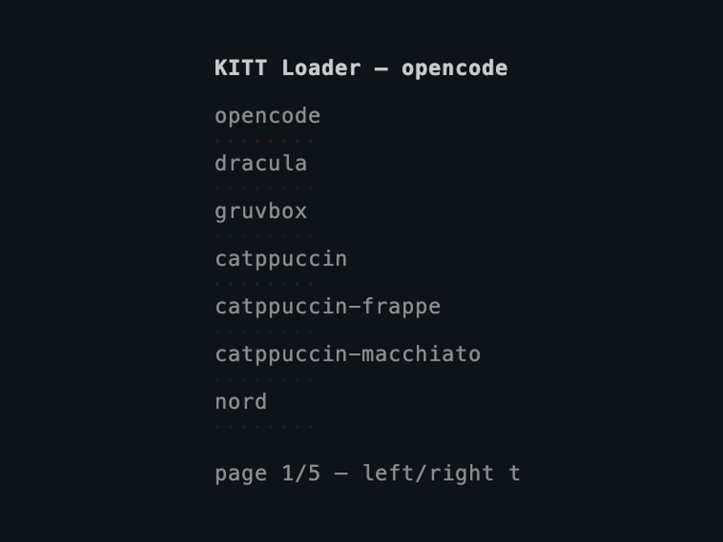

# ratatui-opentui-loader

[](https://crates.io/crates/ratatui-opentui-loader)
[](LICENSE.md)

KITT-style (Knight Rider) scanner/loader widget for [ratatui](https://ratatui.rs).

Inspired by the [opencode](https://github.com/opencode-ai/opencode) bottom-left spinner.



## Features

- Bidirectional scanner with color trail (`■` active, `⬝` inactive)
- Trail dissolves at edges — no hard bounce
- Inactive dots "breathe" (fade in/out) during hold phases
- Asymmetric timing: brief pause at right edge, longer rest at left
- 34 built-in themes matching opencode (Dracula, Gruvbox, Catppuccin, Nord, Tokyonight, etc.)
- Custom accent color support
- Invertible trail for light backgrounds
- Implements `ratatui::Widget`
- Also exposes `into_line()` for composing into larger widgets

## Usage

```rust
use ratatui_opentui_loader::{KittLoader, Theme};

// Create a loader and tick it each frame (~40ms)
let mut loader = KittLoader::with_theme(Theme::Dracula);
loader.tick();

// As a Widget (auto-sizes to area)
frame.render_widget(&loader, area);

// As a Line (for composing)
let line = loader.into_line(20);

// With a custom color
let mut loader = KittLoader::with_color(Color::Rgb(236, 72, 153));

// Inverted trail for light backgrounds
let mut loader = KittLoader::with_theme(Theme::Github).inverted(true);
```

## Themes

All opencode dark-mode themes are built in:

Opencode, Dracula, Gruvbox, Catppuccin, Catppuccin Frappe, Catppuccin Macchiato,
Nord, Tokyonight, Solarized, Rosepine, Ayu, Monokai, One Dark, Kanagawa, Material,
Everforest, Github, Amoled, Aura, Carbonfox, Cobalt2, Cursor, Flexoki, Matrix,
Mercury, Nightowl, Palenight, Shades of Purple, Synthwave '84, Vesper, Zenburn,
Vercel, Orng, Osaka Jade.

## Run the example

```sh
cargo run --example demo
```

Use left/right arrows to page through all themes.

## License

MIT
